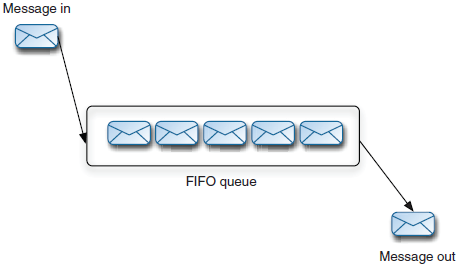
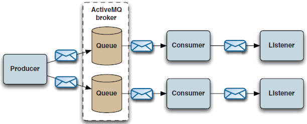

# 5、ActiveMQ消息存储

**传输模式**：持久化和非持久化。持久化消息必须记录到一个稳定的存储中。

存储队列：FIFO（先进先出）

存储主题：

ActiveMQ推荐消息存储的方式：KahaDB

**AMQ消息存储**：像KahaDB，结合事务日志用于可靠的持久性（以应对系统的崩溃），当消息吞吐量是应用程序主要需求时，这是一个最好的存储方式。

**JDBC消息存储**允许消息存储在数据库中。默认数据库是：Apache Derby

**内存消息存储**将所有的消息存储在内存中

恢复策略允许微调为非持久主题消费者缓存的消息的持续时间和类型

