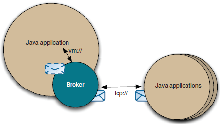
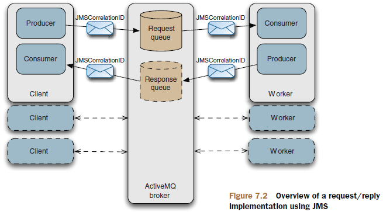

# 7、使用ActiveMQ创建java应用程序

完整配置的代理可以为来自相同应用程序（使用VM协议）的客户机和来自远程应用程序的客户机提供服务。



**使用java嵌入ActiveMQ**

**起点：**org.apache.activemq.broker.BrokerService

BrokerFactory:使用ActiveMQ URI创建代理的实例

xbean URI告诉代理在classpath类路径下搜索给定的XML配置文件

**使用spring嵌入ActiveMQ**

使用一个纯净的Spring XML语法和ActiveMQ,，在spring配置文件中定义BrokerService作为一个bean

默认情况下，ActiveMQ使用spring和Apache XBean进行内部配置。XBean提供定义和使用自定义的XML语法的能力

```text
org.apache.xbean.spring.context.FileSystemXmlApplicationContext context = new
FileSystemXmlApplicationContext(config);
```

**实现JMS的请求/应答**

请求/应答场景涉及发送消息（request）并期望接收消息（reply）的应用程序。世界上一些最可扩展性系统是使用异步处理的。

在下面的图表中，生产者以JMS消息的形式创建一个请求，并设置两个请求重要的属性：

相关联ID和应答目的地。客户端在应答目的地配置一个消费者进行监听。

其次，工作人员接收请求，处理请求，并使用请求消息的JMSReplyTo属性向指定的目的地发送应答消息。



增加程序可伸缩性，只需要增加worker来处理负载。

**分配相关ID:**

```text
response.setJMSCorrelationID(message.getJMSCorrelationID());
```

**在客户端，发送请求**

```text
TextMessage txtMessage = session.createTextMessage();
txtMessage.setText(request);
txtMessage.setJMSReplyTo(tempDest);
txtMessage.setJMSCorrelationID(correlationId);
this.producer.send(txtMessage);
```

**等待应答**

```text
tempDest = session.createTemporaryQueue();
consumer = session.createConsumer(tempDest);
consumer.setMessageListener(this);
public void onMessage(Message message) {
…
}
```

**使用Spring编写JMS客户机**

**配置JMS连接配置**

```text
<bean id="jmsConnectionFactory"
class="org.apache.activemq.ActiveMQConnectionFactory">
<property name="brokerURL" value="tcp://localhost:61616" />
<property name="userName" value="admin" />
<property name="password" value="password" />
</bean>
```

**配置JMS目的地配置**

```text
<bean id="cscoDest" class="org.apache.activemq.command.ActiveMQTopic">
    <constructor-arg value="STOCKS.CSCO" />
</bean>
```

**创建JMS消费者**

```text
<bean id="cscoConsumer"
    class="org.springframework.jms.listener.DefaultMessageListenerContainer">
    <property name="connectionFactory" ref="jmsConnectionFactory" />
    <property name="destination" ref="cscoDest" />
    <property name="messageListener" ref="portfolioListener" />
</bean>
```

**创建JMS生产者**

JmsTemplate是一个发送消息的方便类

```text
<bean id="jmsTemplate" class="org.springframework.jms.core.JmsTemplate">
    <property name="connectionFactory" ref="pooledJmsConnectionFactory" />
</bean>
<bean id="stockPublisher" class="org….book.ch7.spring.SpringPublisher">
    <property name="template" ref="jmsTemplate" />
    <property name="destinations">
    <list>
        <ref local="cscoDest" />
        <ref local="orclDest" />
    </list>
    </property>
</bean>
Destination destination = destinations[idx];
template.send(destination, getStockMessageCreator(destination));
```

